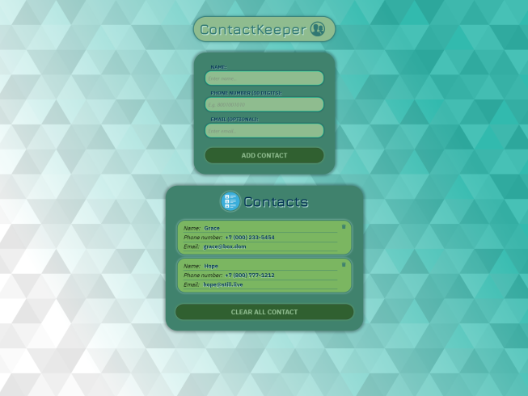

<h1 align="center">Contact Keeper - ReactJS App</h1>

#### To start the app you need next:

- Clone repository:

```
    https://github.com/bakNa2t/contactkeeper
```

or download it from [here](https://github.com/bakNa2t/contactkeeper/archive/master.zip) zip file

- Install dependencies in the project directory:

```
    npm install
```

- Start the app on `localhost:3000`:

```
    npm start
```

#### Click image to open app

<div align="center">
    <p style="width: 500px;">
        <a href="https://bakna2t.github.io/contactkeeper/">
            
        </a>
    </p>
</div>
